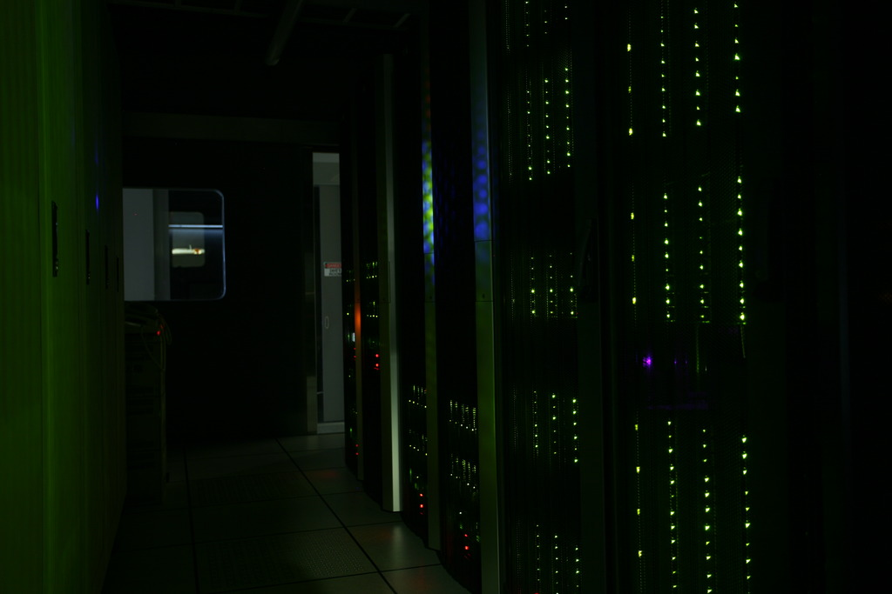

# [vfx 2015 Spring](http://www.csie.ntu.edu.tw/~cyy/courses/vfx/15spring/ "Digital Visual Effects 2011 Spring") @ CSIE.NTU.EDU.TW
## project #1: High Dynamic Range Imaging ([original link](http://www.csie.ntu.edu.tw/~cyy/courses/vfx/11spring/assignments/))

### Method #1: Alignment (Medain Threshold Bitmap)
  將圖片RGB資訊轉成灰階，方便後續採取Median Threshold Bitmap方法對位，為了增加對位的精準以及處理速度，把原圖尺寸一直縮小二分之一
到最後有七張不同尺寸等級的圖片，以論文裡的演算法對每兩張不同曝光時間的照片互相比較，並將每次位移暫存並移動，其餘部分填上黑色，從最小尺寸等級一直到原尺寸，完成alignment對位．

1. 直接利用matlab指令將圖片RGB資訊轉成灰階
2. 原圖尺寸一直縮小二分之一，到最後每張不同曝光時間的照片一共分別有七張不同尺寸
3. 計算所有圖片的中位數，圖片裡的像素若大於中位數計為1，否則為0．第二種方法為找出所有像素在中位數±4範圍內，並記為0，其餘記為1．
4. 使用上述兩種方法對每兩張不同曝光時間的圖片進行八個不同方位的比較，算出一個最佳位置
5. 從尺寸最小的圖片往上做比較，進行對位

### Method #2: HDR 
  我們參考Paul E. Debevec 論文中所提到的演算法，最小化目標方程式，滿足矩陣Ax=b，以SVD求解矩陣x，得到g函數，回算
[]
